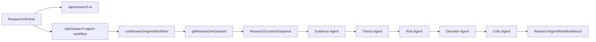

# AI 研究工作台完整改造计划

更新时间：2026-06-08

## 总体目标

把当前单次 AI 研究分析升级为“可审查 agent 工作流”。AI 的职责是把本地研究记录组织成多角色投研协作过程，输出证据审计、论点判断、风险边界、决策草案和复核意见；用户仍然负责最终确认和入库。

## 架构方案



## 文件改造清单

| 文件 | 动作 | 说明 |
| --- | --- | --- |
| `src/lib/research-agent-workflow.ts` | 新增 | 定义 agent stage、workflow 输入输出、stage prompt、顺序执行逻辑。 |
| `src/lib/research-agent-workflow.test.ts` | 新增 | 覆盖 stage 顺序、上下文传递、模型调用、失败处理。 |
| `src/app/api/research-agent-workflow/route.ts` | 新增 | 接收 `securityId`、`question`、`analysisMode`，返回 workflow 结果。 |
| `src/components/research-ai-panel.tsx` | 修改 | 增加“运行 Agent 工作流”按钮和 stage 结果展示。 |
| `tests/e2e/core.spec.ts` | 修改 | 增加前端 agent workflow 展示断言。 |
| `docs/function-knowledge-graph.md` | 修改 | 更新 AI 研究流程图。 |

## 数据结构

```ts
export type ResearchAgentStageId =
  | "evidence"
  | "thesis"
  | "risk"
  | "decision"
  | "critic";

export interface ResearchAgentStageResult {
  id: ResearchAgentStageId;
  title: string;
  status: "completed" | "failed";
  inputSummary: string;
  output: string;
  latencyMs: number;
}

export interface ResearchAgentWorkflowResult {
  mode: "agent-workflow";
  model: string;
  securityId: string;
  analysisMode: ResearchAnalysisMode;
  context: ResearchContextSnapshot;
  stages: ResearchAgentStageResult[];
  finalSummary: string;
}
```

## Agent 分工

| Stage | 输入 | 输出重点 |
| --- | --- | --- |
| Evidence Agent | 本地信息来源、上下文快照、用户问题 | 证据质量、缺口、冲突、需要补充的来源 |
| Thesis Agent | Evidence 输出、投资论点、复核事件 | 论点是否被支持/削弱、失效条件、复核事项 |
| Risk Agent | 前序输出、交易决策、风险主题 | 下行风险、仓位/流动性限制、触发器 |
| Decision Agent | 前序输出、用户问题、交易决策记录 | 可审查行动建议、下一步动作、是否需要生成交易决策草案 |
| Critic Agent | 所有前序输出 | 是否有编造、证据不足、遗漏、过度推断 |

## 实施步骤

1. 新增 `research-agent-workflow.ts` 和单测。
2. 新增 API route。
3. 改造 UI，保留原有单次 AI 分析能力，新增 agent workflow 入口。
4. 更新 E2E。
5. 更新功能知识图谱。
6. 运行 `npm run lint`、`npm run typecheck`、`npm test`、`npm run build`、`npm run test:e2e`。
7. 提交功能分支。
8. 合并回 `main` 并推送 GitHub。

## 迭代后续

- 增加 `research_agent_runs` 和 `research_agent_stages` 表，持久化每次 agent workflow。
- 引入外部数据源适配层，支持新闻、公告、实时行情和基本面自动补全。
- 增加定时复核任务，把 Daily Stock Analysis 的推送/仪表盘思想接入本地复核日历。
- 引入可选图执行器，用于并行 Evidence/Thesis/Risk agent 或失败恢复。

