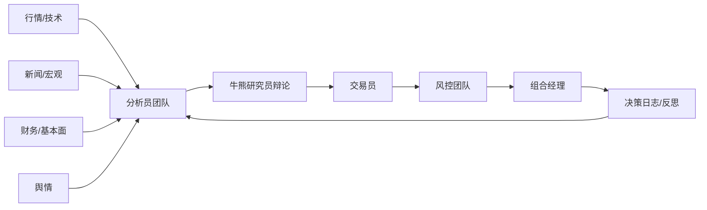
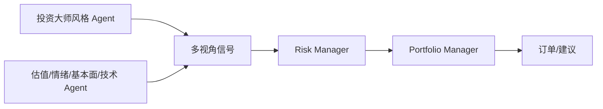
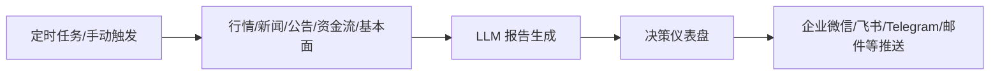
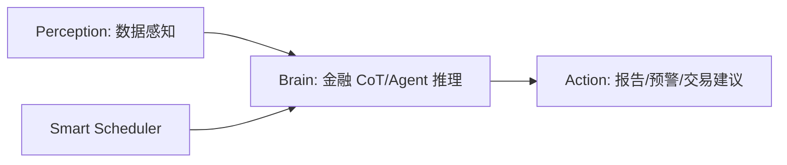
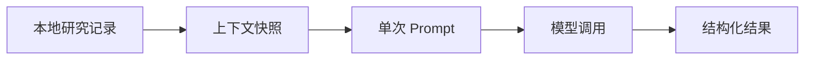

# AI 研究工作台重构本地调研

更新时间：2026-06-08  
工作分支：`codex/ai-agent-research-workbench`

## 目标

当前研究工作台已经具备：

- 信息来源、投资论点、复核事件、交易决策四类本地研究记录。
- OpenAI-compatible 模型配置、连接测试、单次 AI 研究分析。
- 研究简报、证据审计、风险催化、决策备忘四种分析模式。

本轮目标不是再增加一个单次问答入口，而是把“AI 研究”重构成可审查的 agent 工作流：AI 不直接替代交易决策，而是按角色拆解证据、论点、风险和决策，保留每一步输出，供人复核。

## 高赞开源项目调研

GitHub star 数通过 GitHub API 于 2026-06-08 查询。项目说明来自 GitHub README、项目页面和公开文档。

| 项目 | Star | 核心定位 | 主要启发 |
| --- | ---: | --- | --- |
| `TauricResearch/TradingAgents` | 84,316 | 多 Agent LLM 金融交易框架 | 用真实投研机构的角色拆解流程：基本面、舆情、新闻、技术、牛熊研究员、交易员、风控、组合经理；用图状态流转、checkpoint、decision log 支撑可恢复和可复盘。 |
| `OpenBB-finance/OpenBB` | 68,779 | 面向分析师、量化和 AI agent 的金融数据平台 | 把数据层做成“connect once, consume everywhere”，让 AI agent、研究 dashboard、API 共享同一份数据能力。 |
| `virattt/ai-hedge-fund` | 59,879 | AI hedge fund team 概念验证 | agent registry 明确列出投资大师、分析员、风险经理、组合经理，最后由 Portfolio Manager 聚合信号；适合借鉴“多视角信号 + 风险上限 + 最终决策”。 |
| `microsoft/qlib` | 44,164 | AI-oriented 量化投资平台 | 强调数据处理、模型训练、回测、策略、执行、报告的完整链路；对本项目的启发是把研究建议和后续验证/回测分离。 |
| `ZhuLinsen/daily_stock_analysis` | 41,303 | A/H/美股 LLM 日常分析与推送系统 | 多数据源行情、新闻、公告、资金流和基本面聚合后生成决策仪表盘，并通过定时任务/推送进入日常工作流。 |
| `AI4Finance-Foundation/FinRobot` | 7,205 | 金融分析 AI agent 平台 | Perception-Brain-Action 三段式：感知数据、LLM 推理、生成报告/预警/行动；还强调 Smart Scheduler 分配不同 agent 或模型。 |

## 功能与实现逻辑总结

### TradingAgents

关键机制：

- 用 LangGraph 维护图状态，而不是一次性 prompt。
- 角色之间通过 state 传递报告、辩论历史和最终决策。
- 区分 quick model 和 deep model，复杂推理给 deep model。
- checkpoint 支持恢复，decision log 支持下次分析注入历史经验。

适配当前项目：

- 不需要引入 LangGraph，当前 Next.js 服务端可以先实现轻量顺序编排。
- 保留每个 agent 的输入、输出、状态和耗时，作为可审查链路。
- 初期用本地 SQLite 研究记录作为唯一事实来源，避免编造外部信息。

### AI Hedge Fund

关键机制：

- agent registry 是显式配置，便于选择不同 agent 组合。
- 多个 agent 生成 bullish/bearish/neutral 等方向性信号。
- Risk Manager 先给风险边界，Portfolio Manager 再决定是否行动。

适配当前项目：

- 不做“投资大师人格化”，避免不可审计的风格包装。
- 保留“证据分析员、论点审查员、风险官、决策主席”的角色化结构。
- 决策主席不能直接写交易流水，只输出交易决策草案建议。

### Daily Stock Analysis

关键机制：

- 以“每日决策仪表盘”为产品形态，面向重复使用。
- 多数据源聚合后统一传给 LLM。
- 提供 WebUI、API、定时任务、推送渠道。

适配当前项目：

- 本系统是本地单用户投资决策系统，优先做“按标的手动触发 + 可复核工作台”。
- 后续可增加定时复核与提醒，但本轮先沉淀 agent 结果和下一步动作。

### FinRobot

关键机制：

- 把金融数据、文档、市场信息等感知层与 agent 推理层分离。
- 通过专业 agent 生成投资论点、风险评估、估值概览和研究报告。
- Smart Scheduler 用于选择合适 agent/模型。

适配当前项目：

- 用 `ResearchContextSnapshot` 作为 perception 层的本地实现。
- 用 agent workflow 作为 brain 层。
- 用结构化分析结果、下一步动作和交易决策草案作为 action 层。

### OpenBB / Qlib

这两个项目不都是 LLM 股票分析项目，但对架构有强启发：

- OpenBB：数据能力应与 UI 解耦，后续 AI agent、dashboard 和导出都消费统一数据层。
- Qlib：研究、回测、策略、执行、报告是不同阶段，不应把“AI 结论”直接等同于“交易执行”。

## 当前研究工作台反思

当前结构：

问题：

- 单次模型调用缺少中间过程，不容易复核“结论从哪来”。
- 分析模式是 prompt 维度，不是 workflow 维度，无法表达协作过程。
- 风险、证据、决策建议混在同一输出里，后续难以复用到复核事件或交易决策。
- 没有 agent 状态、阶段耗时、阶段输出，无法形成类似投研会议纪要。

建议重构：

```mermaid
flowchart LR
  Dataset["SQLite 本地记录"] --> Context["ResearchContextSnapshot"]
  Context --> Evidence["Evidence Agent"]
  Evidence --> Thesis["Thesis Agent"]
  Thesis --> Risk["Risk Agent"]
  Risk --> Decision["Decision Agent"]
  Decision --> Critic["Critic/Verifier"]
  Critic --> WorkflowResult["Agent Workflow Result"]
  WorkflowResult --> UI["AI 研究工作台"]
```

本轮落地边界：

- 后端增加轻量 agent workflow 编排，不引入 LangGraph。
- 每个 stage 明确 role、inputSummary、output、status、latencyMs。
- UI 增加“Agent 工作流”触发和阶段结果视图。
- 测试覆盖 workflow prompt、stage 顺序、API、E2E 展示。

