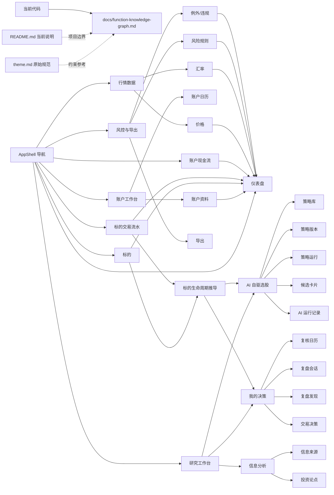
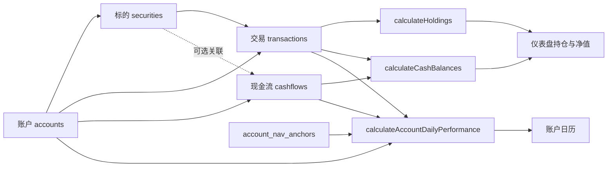
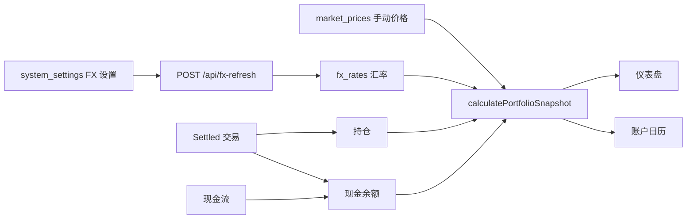
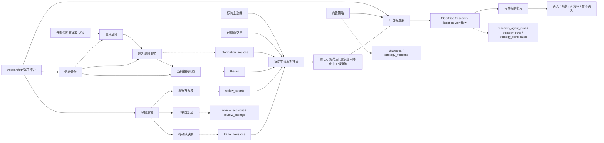
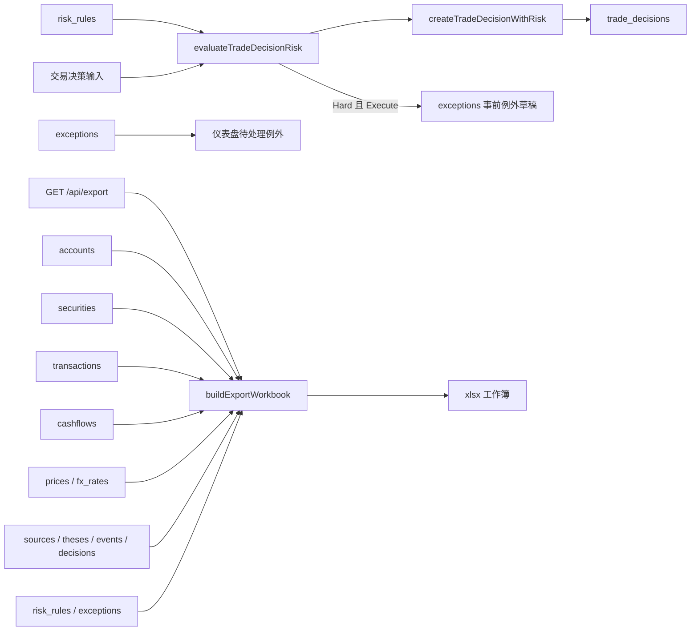
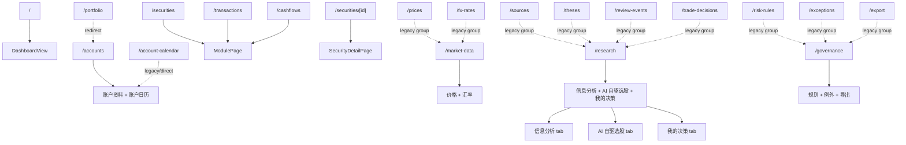
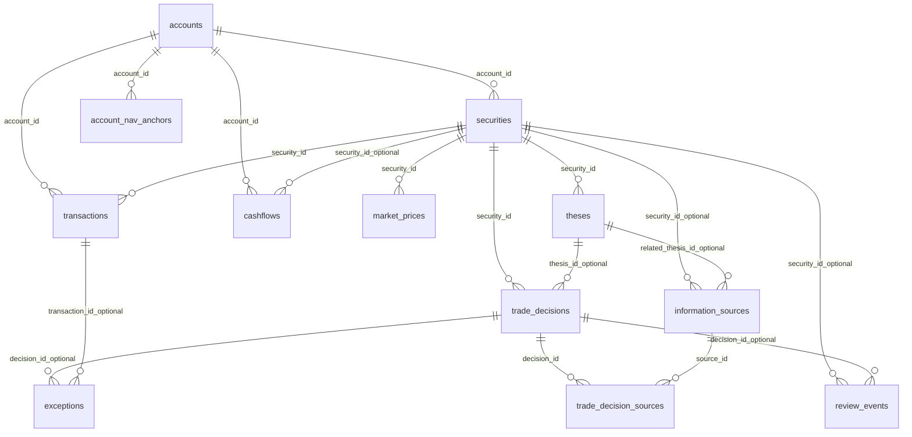
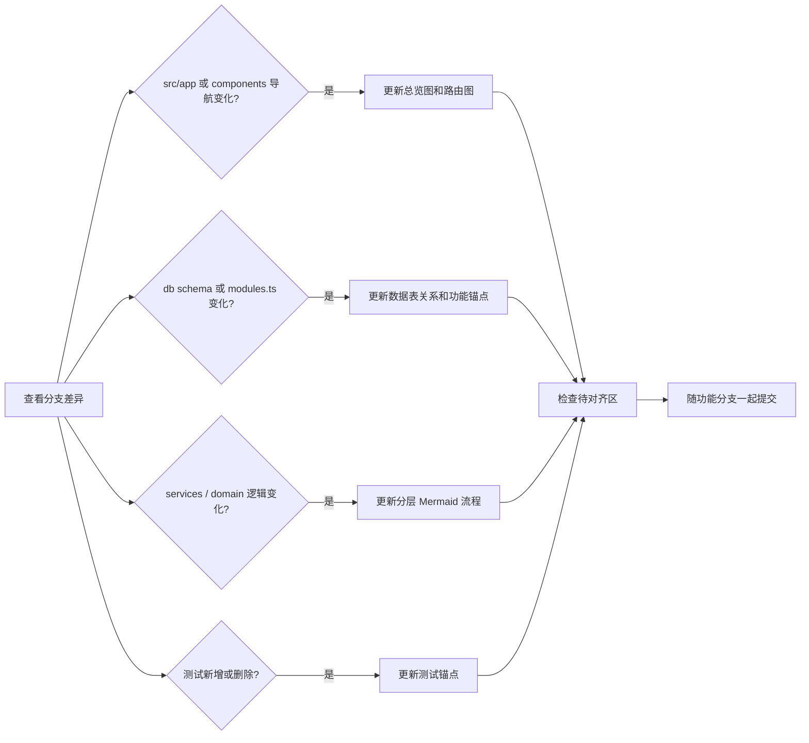

# 功能知识图谱

> 维护目标：保证“代码已经实现的功能”和“可读的功能知识图谱”一致。每次合并分支前，如果路由、数据表、模块定义、服务逻辑或测试覆盖发生变化，需要同步更新本文。

生成日期：2026-06-05  
事实来源：当前代码、`README.md`、`theme.md`、`docs/` 下已确认设计记录。

## 维护约定

- 以代码为准：只有在路由、模块定义、服务逻辑或测试中能找到锚点的能力，才写入“当前实现”。
- 原始规范不等于已实现：`theme.md` 中已有设计但当前代码未落地的内容，放入“待对齐区”。
- Mermaid 图表达功能关系，锚点表表达代码位置；不要用长段需求文字替代可验证锚点。
- 合并分支前优先检查：
  - `src/app/**`：页面、路由、API 变化。
  - `src/lib/modules.ts`：模块字段、日历语义、表格展示变化。
  - `src/lib/db/client.ts` 和 `src/lib/db/schema.ts`：数据表变化。
  - `src/lib/services.ts` 及领域服务：业务逻辑变化。
  - `src/lib/*.test.ts` 和 `tests/e2e/*.ts`：测试覆盖变化。

## 总览图



## 功能分层

### 事实账本层



当前边界：

- 账户、标的、交易、现金流是已实现的基础录入模块。
- 交易的 `Settled` 状态不可直接编辑，通过更正记录修正。
- 账户日历不是账户主数据日历，而是基于交易、现金流、行情、汇率、NAV 锚点重算的日绩效视图。

### 行情与估值层



当前边界：

- 仪表盘使用最新市场日期，并取该日期之前可用的最新价格和汇率。
- 外币现金会用最新可用汇率重估，同时保留历史基准金额作为回退。
- FX 自动刷新使用 Frankfurter provider，刷新结果写入 `fx_rates`。

### 研究到交易决策层



当前边界：

- `/research` 主入口面向用户只暴露 `信息分析`、`AI 自驱选股`、`我的决策` 三个页签。
- 来源智能只生成可审查草稿，不直接保存记录；用户确认后的结构化记录仍由底层模块表承接。
- 标的生命周期由现有主数据、已结算交易和研究记录推导，区分 `观察池`、`持仓中`、`已退出复盘`、`候选池`、`禁用`，不写入新的手工状态字段。
- `AI 自驱选股` 默认使用 `观察池 + 持仓中 + 候选池`，排除已退出标的；用户显式选择 `已退出复盘` 或 `全部可研究` 时才纳入已退出标的。
- AI 选股运行时显示 agent 进度，避免用户只能看到按钮等待。
- 策略、策略版本、策略运行、候选卡片、AI 运行记录仍存在，但在主工作台中是 AI 自驱选股的实现和审计层，不再作为一级用户页签。
- 交易决策和复核事件在 `我的决策` 中按待确认、观察复核、已完成记录摘要展示；完整字段仍可通过底层模块路由维护。
- 旧的单次 AI 分析和 Agent 工作流能力仍保留为 API/组件底座，当前主工作台优先呈现可读的策略选股结果。

### 风控与治理层



当前边界：

- 风控检查当前覆盖单一主动标的仓位、主题暴露、计划交易风险。
- 硬规则不阻止保存执行型决策，但会生成事前例外草稿。
- 导出生成 Excel workbook，覆盖 V1 核心模块。

## 功能锚点表

| 功能节点 | 当前用途 | 页面 / API 锚点 | 数据锚点 | 代码锚点 | 测试锚点 |
| --- | --- | --- | --- | --- | --- |
| 仪表盘 | 汇总组合净值、现金、集中度、例外、近期决策、复核事件 | `src/app/page.tsx` | `accounts`, `securities`, `transactions`, `cashflows`, `market_prices`, `fx_rates`, `risk_rules`, `exceptions`, `review_events` | `src/lib/services.ts#getDashboardData`, `src/lib/portfolio.ts` | `src/lib/db.integration.test.ts`, `src/lib/finance.test.ts`, `tests/e2e/core.spec.ts` |
| 账户资料 | 管理账户属性、支持市场、是否纳入净值 | `src/app/accounts/page.tsx`, `src/app/[module]/page.tsx`, `src/app/api/modules/[module]/route.ts` | `accounts` | `src/lib/modules.ts`, `src/lib/services.ts`, `src/lib/module-records.ts` | `src/lib/db.integration.test.ts`, `tests/e2e/core.spec.ts` |
| 账户日历 | 按日重算账户 NAV、现金、P&L、外部现金流和 NAV 锚点 | `src/app/accounts/page.tsx`, `src/app/account-calendar/page.tsx`, `src/app/api/account-nav-anchors/route.ts` | `account_nav_anchors`, `accounts`, `transactions`, `cashflows`, `market_prices`, `fx_rates` | `src/components/account-calendar-page.tsx`, `src/lib/account-performance.ts`, `src/lib/account-calendar-view.ts`, `src/lib/services.ts#getAccountCalendarData` | `src/lib/account-calendar-view.test.ts`, `src/lib/finance.test.ts`, `src/lib/db.integration.test.ts`, `tests/e2e/core.spec.ts` |
| 标的 | 管理资产代码、账户关联、行业、风险主题、流动性、投资状态 | `src/app/[module]/page.tsx`, `src/app/securities/[id]/page.tsx` | `securities` | `src/lib/modules.ts`, `src/lib/security-liquidity.ts`, `src/components/security-detail-page.tsx` | `src/lib/db.integration.test.ts`, `tests/e2e/core.spec.ts` |
| 标的交易流水 | 记录买卖、申赎、转入转出；派生成交总额和基准金额 | `src/app/[module]/page.tsx`, `src/app/api/modules/[module]/route.ts` | `transactions` | `src/lib/modules.ts`, `src/lib/services.ts`, `src/lib/module-records.ts` | `src/lib/db.integration.test.ts`, `src/lib/finance.test.ts`, `tests/e2e/core.spec.ts` |
| 账户现金流 | 记录出入金、分红、利息、费用、换汇；派生收益和外部现金流标记 | `src/app/[module]/page.tsx`, `src/app/api/modules/[module]/route.ts` | `cashflows` | `src/lib/modules.ts`, `src/lib/services.ts` | `src/lib/db.integration.test.ts`, `src/lib/finance.test.ts`, `tests/e2e/core.spec.ts` |
| 价格 | 手动维护估值价格，并支持待补价格队列 | `src/app/market-data/page.tsx`, `src/app/[module]/page.tsx` | `market_prices` | `src/lib/modules.ts`, `src/lib/services.ts#getPriceEntrySecurities`, `src/components/price-quick-panel.tsx` | `src/lib/db.integration.test.ts`, `tests/e2e/core.spec.ts` |
| 汇率 | 手动维护 FX，支持自动刷新和快速录入 | `src/app/market-data/page.tsx`, `src/app/api/fx-refresh/route.ts` | `fx_rates`, `system_settings` | `src/lib/fx-refresh.ts`, `src/components/fx-quick-panel.tsx`, `src/lib/module-interactions.ts#getLatestFxRates` | `src/lib/fx-refresh.test.ts`, `src/lib/module-interactions.test.ts`, `tests/e2e/core.spec.ts` |
| 信息分析 | 将外部资料整理成可读事实，并结合投资论点形成当前观点 | `src/app/research/page.tsx`, `src/app/api/source-intelligence/route.ts` | `information_sources`, `theses` | `src/components/research-workbench-panels.tsx`, `src/components/source-intelligence-panel.tsx`, `src/lib/source-intelligence.ts`, `src/lib/modules.ts` | `src/lib/source-intelligence.test.ts`, `tests/e2e/core.spec.ts` |
| 信息来源 | 底层记录证据等级、关键事实、原始链接、论点影响 | `src/app/[module]/page.tsx`, `src/app/api/source-intelligence/route.ts` | `information_sources` | `src/lib/modules.ts`, `src/lib/source-intelligence.ts`, `src/components/source-intelligence-panel.tsx` | `src/lib/source-intelligence.test.ts`, `tests/e2e/core.spec.ts` |
| 投资论点 | 底层记录主动、交易、实验策略的论点、情景、失效和复核日期 | `src/app/[module]/page.tsx` | `theses` | `src/lib/modules.ts`, `src/lib/module-interactions.ts` | `src/lib/module-interactions.test.ts`, `tests/e2e/core.spec.ts` |
| 标的生命周期推导 | 从主数据、已结算交易和研究记录推导观察池、持仓中、已退出、候选池、禁用 | `src/app/research/page.tsx` | `securities`, `transactions`, `information_sources`, `theses`, `review_events`, `trade_decisions` | `src/lib/security-lifecycle.ts`, `src/components/module-workspace.tsx` | `src/lib/security-lifecycle.test.ts`, `src/lib/research-iteration-workflow.test.ts`, `tests/e2e/core.spec.ts` |
| AI 自驱选股 | 从内置策略触发候选筛选，默认排除已退出标的，展示标的分层、建议动作、证据缺口、风险和 agent 进度 | `src/app/research/page.tsx`, `src/app/api/research-iteration-workflow/route.ts` | `strategies`, `strategy_versions`, `strategy_runs`, `strategy_candidates`, `research_agent_runs`, `research_agent_stages` | `src/components/ai-stock-picks-panel.tsx`, `src/components/research-workbench-panels.tsx`, `src/lib/research-iteration-workflow.ts`, `src/lib/security-lifecycle.ts` | `src/lib/research-iteration-workflow.test.ts`, `src/lib/security-lifecycle.test.ts`, `tests/e2e/core.spec.ts` |
| 策略库 | 底层维护散户慢频策略假设、证据门槛、风险预算和复盘频率 | `src/app/[module]/page.tsx` | `strategies` | `src/lib/modules.ts`, `src/lib/db/seed.ts` | `src/lib/research-iteration-workflow.test.ts`, `src/lib/db.integration.test.ts` |
| 策略版本 | 底层保存策略版本，复盘后通过新版本承接规则变化 | `src/app/[module]/page.tsx` | `strategy_versions` | `src/lib/modules.ts`, `src/lib/db/seed.ts` | `src/lib/research-iteration-workflow.test.ts`, `src/lib/db.integration.test.ts` |
| 策略运行 | 底层记录每次策略筛选的范围、摘要和关联 AI 运行 | `src/app/[module]/page.tsx`, `src/app/api/research-iteration-workflow/route.ts` | `strategy_runs`, `research_agent_runs` | `src/lib/research-iteration-workflow.ts`, `src/lib/modules.ts` | `src/lib/research-iteration-workflow.test.ts`, `tests/e2e/core.spec.ts` |
| 候选卡片 | 底层保存策略运行产生的候选标的、适配分、证据缺口、风险和下一步动作 | `src/app/[module]/page.tsx` | `strategy_candidates` | `src/lib/research-iteration-workflow.ts`, `src/lib/modules.ts` | `src/lib/research-iteration-workflow.test.ts`, `tests/e2e/core.spec.ts` |
| 我的决策 | 汇总待确认决策、观察复核和已完成记录，面向行动和回看 | `src/app/research/page.tsx`, `src/app/api/trade-decisions/route.ts` | `trade_decisions`, `trade_decision_sources`, `review_events`, `review_sessions`, `review_findings` | `src/components/research-workbench-panels.tsx`, `src/components/trade-decisions-page.tsx`, `src/lib/services.ts#createTradeDecisionWithRisk`, `src/lib/validation.ts` | `src/lib/db.integration.test.ts`, `src/lib/finance.test.ts`, `tests/e2e/core.spec.ts` |
| 复核日历 | 底层管理财报、复核、风险事件和后续行动 | `src/app/[module]/page.tsx` | `review_events` | `src/lib/modules.ts`, `src/lib/module-interactions.ts` | `src/lib/module-interactions.test.ts`, `tests/e2e/core.spec.ts` |
| 复盘会话 | 底层记录按时间窗口、事件或策略触发的结构化复盘 | `src/app/[module]/page.tsx`, `src/app/api/research-iteration-workflow/route.ts` | `review_sessions` | `src/lib/research-iteration-workflow.ts`, `src/lib/modules.ts` | `src/lib/research-iteration-workflow.test.ts`, `tests/e2e/core.spec.ts` |
| 复盘发现 | 底层把复盘结论关联到策略、标的、论点或交易决策 | `src/app/[module]/page.tsx` | `review_findings` | `src/lib/research-iteration-workflow.ts`, `src/lib/modules.ts` | `src/lib/research-iteration-workflow.test.ts` |
| AI 研究底座 | 基于本地研究记录生成上下文快照；保留单次分析、五段 Agent 工作流和迭代工作流 API | `src/app/api/research-ai/route.ts`, `src/app/api/research-agent-workflow/route.ts`, `src/app/api/research-iteration-workflow/route.ts` | `securities`, `information_sources`, `theses`, `review_events`, `trade_decisions`, `research_agent_runs`, `research_agent_stages` | `src/components/research-ai-panel.tsx`, `src/lib/research-ai.ts`, `src/lib/research-agent-workflow.ts`, `src/lib/research-iteration-workflow.ts`, `src/lib/model-client.ts` | `src/lib/research-ai.test.ts`, `src/lib/research-agent-workflow.test.ts`, `src/lib/research-iteration-workflow.test.ts`, `src/lib/model-client.test.ts`, `tests/e2e/core.spec.ts` |
| 风险规则 | 维护交易决策校验使用的阈值和级别 | `src/app/governance/page.tsx`, `src/app/[module]/page.tsx` | `risk_rules` | `src/lib/modules.ts`, `src/lib/risk.ts` | `src/lib/finance.test.ts`, `src/lib/db.integration.test.ts`, `tests/e2e/core.spec.ts` |
| 例外/违规 | 记录事前例外、事后违规、数据错误、流程遗漏 | `src/app/governance/page.tsx`, `src/app/[module]/page.tsx` | `exceptions` | `src/lib/modules.ts`, `src/lib/services.ts#createTradeDecisionWithRisk` | `src/lib/db.integration.test.ts`, `tests/e2e/core.spec.ts` |
| 导出 | 导出 V1 核心模块 Excel workbook | `src/app/governance/page.tsx`, `src/app/export/page.tsx`, `src/app/api/export/route.ts` | 多核心表 | `src/lib/export.ts`, `src/lib/services.ts#listAllExportData`, `src/components/export-page.tsx` | `src/lib/finance.test.ts`, `tests/e2e/core.spec.ts` |
| 系统设置 | 管理基准货币、语言、FX、颜色、模型执行模式、OpenAI-compatible API、来源智能配置 | `src/app/api/settings/route.ts`, `src/app/api/model-test/route.ts` | `system_settings` | `src/lib/app-settings.ts`, `src/lib/model-client.ts`, `src/components/app-settings-dialog.tsx`, `src/components/app-settings-provider.tsx` | `src/lib/settings.test.ts`, `src/lib/model-client.test.ts`, `tests/e2e/core.spec.ts` |
| 国际化和帮助 | 支持简体中文、繁体中文、英文和字段帮助提示 | 全局 UI | 无独立业务表 | `src/lib/i18n.ts`, `src/components/language-provider.tsx`, `src/components/help-tooltip.tsx` | `src/lib/i18n.test.ts`, `tests/e2e/core.spec.ts` |

## 路由和工作台关系



导航锚点：`src/components/app-shell.tsx`。  
通用模块页锚点：`src/app/[module]/page.tsx`、`src/components/module-page.tsx`、`src/components/module-workspace.tsx`。

## 数据表关系



表结构锚点：

- SQL 初始化：`src/lib/db/client.ts`
- Drizzle schema：`src/lib/db/schema.ts`
- Demo seed：`src/lib/db/seed.ts`

## 合并分支更新清单



建议命令：

```bash
git diff --name-only main...HEAD
rg -n "id: \"|navLabelZh|descriptionZh|calendar:" src/lib/modules.ts
rg -n "CREATE TABLE IF NOT EXISTS|sqliteTable\\(" src/lib/db/client.ts src/lib/db/schema.ts
rg -n "describe\\(|test\\(" src/lib/*.test.ts tests/e2e/*.ts
```

## 待对齐区

这些内容来自原始规范或数据库结构，但当前不能写入“已实现功能图谱”：

| 主题 | 当前状态 | 判断依据 |
| --- | --- | --- |
| S00 投资政策与系统参数表 | 只有 `system_settings` 承载应用配置；没有完整投资政策工作台 | `src/lib/app-settings.ts`, `src/lib/db/client.ts` |
| S05 持仓与组合快照表 | 有 `holding_snapshots`、`portfolio_snapshots` 表结构；当前仪表盘主要从交易、现金流、价格、汇率实时重算 | `src/lib/db/client.ts`, `src/lib/services.ts#getDashboardData`, `src/lib/portfolio.ts` |
| S12 月度复盘表 | 未发现独立路由、模块定义或服务逻辑 | `src/app/**`, `src/lib/modules.ts` |
| S13 季度系统评估表 | 未发现独立路由、模块定义或服务逻辑 | `src/app/**`, `src/lib/modules.ts` |
| `thesis_evidence` | 有表结构；当前主要使用 `information_sources.related_thesis_id` 和 `trade_decision_sources` 表达证据关系 | `src/lib/db/client.ts`, `src/lib/modules.ts`, `src/lib/services.ts` |
