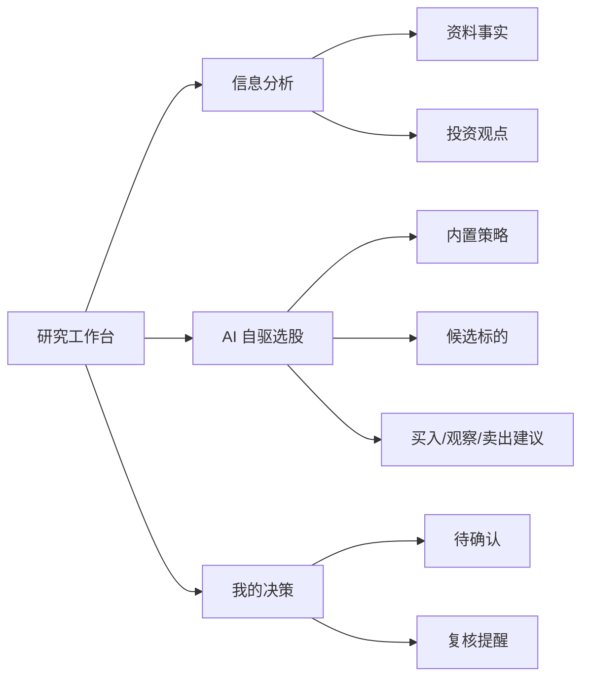

# 研究工作台简化重构设计

## 背景

现有研究工作台把策略、策略版本、策略运行、候选卡片、复盘会话、复盘发现、AI 运行记录等后台对象直接暴露给用户。它适合验证数据模型，但不适合散户日常决策。用户真正需要的是看懂信息、发现候选、做出买入/卖出/观察决策，而不是操作状态机。

## 目标

将研究工作台重构为三个面向用户的入口：

1. `信息分析`：合并信息来源和投资论点分析。用户粘贴外部资料、整理事实、形成可读观点。
2. `AI 自驱选股`：内置策略驱动候选筛选，给出标的、动作建议和风险原因。
3. `我的决策`：汇总待确认决策、已有决策和复核提醒，帮助用户行动和回看。

## 非目标

- 本轮不删除底层表。旧数据结构保留给审计、测试和后续自动化使用。
- 本轮不做自动下单，不连接券商。
- 本轮不做真正定时任务调度，只在 UI 中表达“手动更新/定期更新”的产品语义。

## 信息架构

## 页面设计

### 信息分析

- 顶部放“信息智能获取”输入区，支持资料正文、原始链接、关联标的和生成草稿。
- 下方用两列摘要展示最近信息和当前投资观点。
- 文案弱化“来源/论点表”，使用“事实”“观点”“影响”“下一步”。

### AI 自驱选股

- 顶部显示策略选择、分析标的和“立即更新选股”按钮。
- 结果用候选卡片展示：标的、动作建议、适配分、为什么入选、缺什么证据、主要风险。
- 后台仍写入 `research_agent_runs`、`strategy_runs`、`strategy_candidates`，但 UI 不暴露这些 ID 作为主信息。

### 我的决策

- 汇总交易决策和复核事件。
- 卡片分成“待确认/执行中”“观察与复核”“已完成记录”。
- 显示动作、标的、风险、下一次复核日期。

## 测试策略

- 更新 e2e：研究工作台只验证 3 个页签。
- 保留 AI 工作流 e2e：从 `AI 自驱选股` 触发策略运行并展示候选。
- 保留单元和集成测试：底层表、workflow、模块路由不删除。
