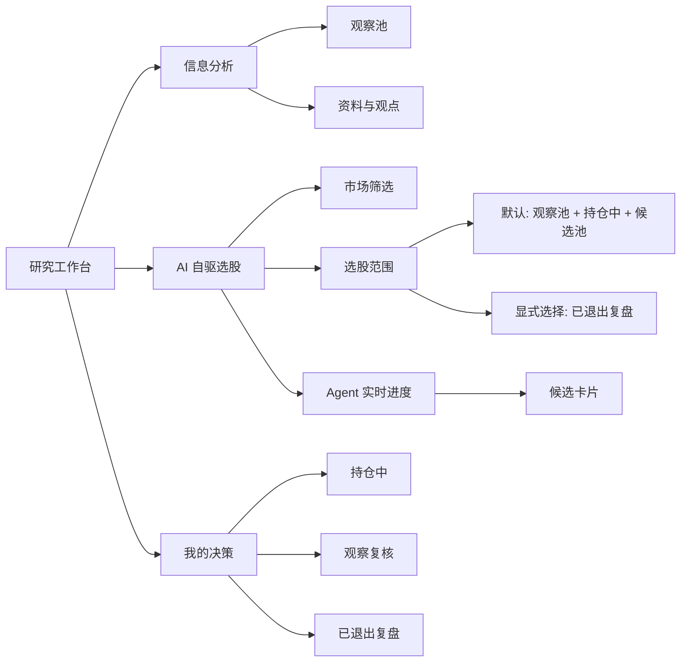

# 研究工作台标的分层与实时工作流设计

## 背景

当前研究工作台已经简化为 `信息分析`、`AI 自驱选股`、`我的决策` 三个入口，但 `AI 自驱选股` 仍主要按证券主数据和策略分数展示候选。产品上还缺少两个关键边界：

1. 用户需要直接区分“我正在观察什么”和“我真实交易/持有什么”。
2. AI 选股不能因为历史交易记录而默认只围绕已退出标的打转。
3. Agent 工作流目前一次请求后才返回结果，用户看不到 agent 正在做哪一步。

本轮以散户日常决策为目标，弱化后台状态机，强化可读的标的分层、默认候选范围和实时进度。

## 自主澄清结论

用户要求“自己思考、自己澄清、自己推进”，因此本设计采用以下产品定义：

| 分层 | 产品含义 | 数据推导 |
| --- | --- | --- |
| `观察池` | 已经进入研究视野，但当前没有真实持仓 | 当前持仓数量为 0，且 `investment_status = Watch`，或存在信息来源、投资论点、复核事件、交易决策记录 |
| `持仓中` | 当前真实持有的标的 | 已结算交易按 `calculateHoldings` 推导后数量大于 0 |
| `已退出` | 历史持有过，但当前已经清仓 | 曾有已结算 `Buy/Subscribe`，当前持仓数量为 0 |
| `候选池` | 可研究但尚未观察、也未交易过 | `investment_status = Allowed`，非现金，且不属于观察池、持仓中、已退出 |
| `禁用` | 当前不能纳入选股 | `investment_status = Prohibited` 或资产类型为 `Cash` |

`securities.investment_status` 继续作为合规/关注状态，不直接等同真实持仓。真实交易事实只从已结算交易推导。

## 方案比较

### 方案 A：只在前端按状态展示

优点是改动少。缺点是 AI 后台仍不知道标的生命周期，选股结果和 UI 分层可能不一致。

### 方案 B：新增数据库字段维护生命周期

优点是查询简单。缺点是生命周期会和交易流水产生双写，用户清仓后还需要手工改状态，容易不一致。

### 方案 C：新增后端生命周期推导层

推荐方案。用现有 `securities`、`transactions`、`information_sources`、`theses`、`review_events`、`trade_decisions` 推导统一生命周期，前端、AI 选股、决策中心共用同一套结果。暂不改 schema，后续如需要 watchlist 表再迁移。

## 目标体验



## 功能设计

### 1. 标的生命周期服务

新增轻量服务 `security-lifecycle`：

- 输入：数据库上下文。
- 输出：每个标的的生命周期、当前持仓数量、是否历史交易过、资料数、论点数、复核数、决策数。
- 约束：不写库，不引入新字段。
- 复用：AI 选股、研究页参考标的、我的决策和测试。

生命周期优先级：

1. `Prohibited/Cash` -> `blocked`
2. 当前持仓数量大于 0 -> `holding`
3. 曾有已结算买入/申购且当前数量为 0 -> `exited`
4. `investment_status = Watch` 或存在研究/决策记录 -> `observed`
5. `investment_status = Allowed` -> `candidate`
6. 其他 -> `blocked`

### 2. AI 自驱选股范围

`AI 自驱选股` 增加 `选股范围`：

- `默认研究范围`：观察池 + 持仓中 + 候选池。默认值。
- `观察池`：只看未持仓但正在研究的标的。
- `持仓中`：只看当前真实持仓，适合加减仓/继续持有判断。
- `候选池`：只看尚未观察也未交易的可研究标的。
- `已退出复盘`：只看已清仓标的，用于复盘，不作为默认选股。
- `全部可研究`：观察池 + 持仓中 + 候选池 + 已退出。

策略运行默认排除 `已退出` 和 `禁用`。如果结果为空，UI 给出清晰解释，而不是把已退出标的自动补进来。

候选卡片新增生命周期标签：

- `观察池`
- `持仓中`
- `候选池`
- `已退出复盘`

评分逻辑调整：

- `持仓中` 不因为“已经买过”被排除，但行动建议更偏向复核、继续持有或调整仓位。
- `观察池` 和 `候选池` 可以给出补资料、建论点、生成决策草案。
- `已退出` 默认不出现；显式选择后只给复盘/重新观察建议，不直接给买入草案。

### 3. Agent 实时进度

先在 `AI 自驱选股` 做用户可见的实时阶段进度：

- 点击“立即更新选股”后，前端立刻显示阶段列表：
  - `读取策略`
  - `整理标的池`
  - `检查资料与论点`
  - `筛选候选`
  - `生成行动建议`
- 正常 API 仍返回最终结果，阶段状态在等待期间按顺序进入 `running/completed`，最终用服务端返回的 stages 覆盖。
- 如果 API 失败，当前运行阶段标为失败，并展示错误。

这是一个可验证的第一步：用户不会再看到按钮转圈但不知道发生了什么。后续若需要真正服务端逐条事件流，再把 API 升级为 SSE 或 fetch stream。

### 4. 我的决策

`我的决策` 补充生命周期视角：

- 顶部显示分层摘要：观察池、持仓中、已退出、候选池数量。
- `观察与复核` 优先展示观察池和持仓中的待复核事项。
- `已完成记录` 中标出已退出标的，帮助用户复盘。

### 5. 文档同步

更新 `docs/function-knowledge-graph.md`：

- 研究到交易决策层加入 `标的生命周期推导`。
- AI 自驱选股说明更新为默认排除已退出，显式选择才复盘。
- 锚点表加入新服务与测试。

## 测试策略

单元测试：

- 生命周期推导：
  - 有当前持仓 -> `holding`
  - 曾买入后卖出清仓 -> `exited`
  - Watch 或有研究记录但无持仓 -> `observed`
  - Allowed 且无研究/交易 -> `candidate`
  - Prohibited 或 Cash -> `blocked`
- AI 选股：
  - 默认范围不包含已退出。
  - 显式 `exited` 范围只返回已退出标的。
  - 候选返回生命周期标签和匹配规则。

前端 e2e：

- 研究工作台仍有 3 个页签。
- AI 自驱选股展示市场、范围、参考标的。
- 点击更新后能看到 agent 进度。
- 请求体包含市场和选股范围。
- 候选卡片展示生命周期标签。

验证命令：

```bash
npm run lint
npm run typecheck
npm test
npm run build
npm run test:e2e
```

## 非目标

- 本轮不接券商，不自动下单。
- 本轮不把生命周期写入数据库字段。
- 本轮不做真正后台定时任务。
- 本轮不把所有旧 AI 研究组件暴露回主工作台。

