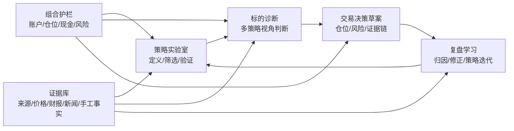
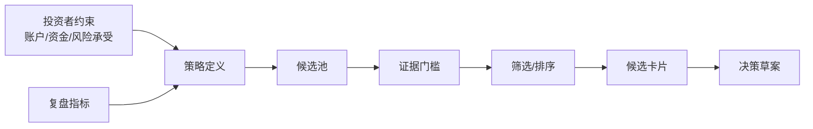
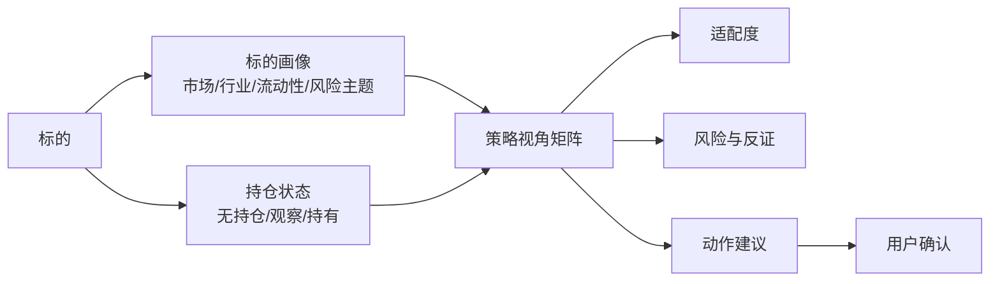
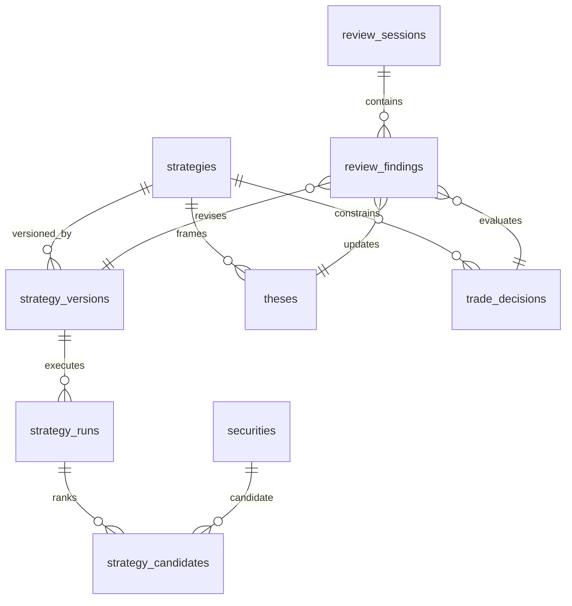
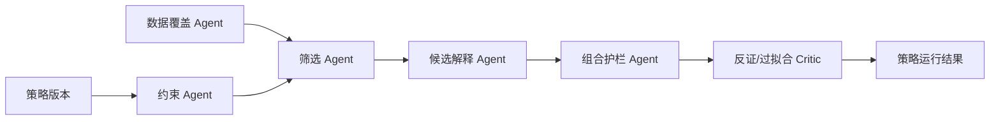
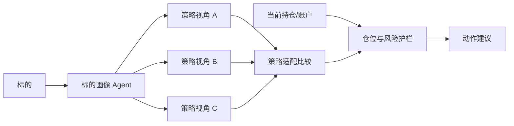
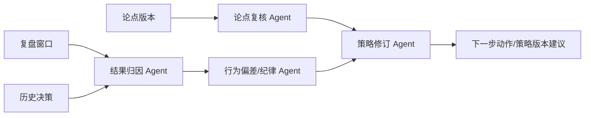

# 研究工作台 AI 功能迭代建议

更新时间：2026-06-10  
定位：面向散户的慢频投资研究工作台，不是高频量化交易平台，也不是自动下单机器人。

## 结论先行

用户提出的“三种驱动方式”方向基本正确，但需要改写：

1. “策略”不应该被定义成“让 AI 告诉我买什么股票”。它应该是一个可版本化、可验证、可复盘的投资假设：适合什么账户、什么市场、什么持有周期、什么买入/卖出条件、最大仓位是多少、用哪些证据确认或否定。
2. “标的”不应该只输出“买入/卖出”。同一个标的在不同策略、不同账户、不同持仓状态下结论会不同。标的驱动更准确的定义是：对某个已关注或已持有资产，运行多个策略视角，给出“是否纳入观察、是否建立论点、是否调仓、是否退出”的可审查建议。
3. “复盘”不应该是第三个并列功能，而应该是整个系统的学习闭环。散户真正容易缺的是纪律、证据链、仓位约束和事后归因，而不是更多观点。复盘必须反向更新策略版本、标的状态和下一次复核任务。

因此建议把研究工作台升级为四个核心能力：

产品判断：你真正需要的不是“AI 选股器”，而是一个“个人投资研究操作系统”：把你临时看到的标的、长期使用的策略、已有持仓、证据来源和定期复盘串起来，减少冲动交易和重复研究。

## 外部参考池

本轮参考的是公开项目和产品形态，重点看工作流结构，不把 star 数、热度或自动交易能力当成可直接复制的价值。

| 类别 | 项目 / 方案 | 可借鉴点 | 不应照搬 |
| --- | --- | --- | --- |
| 金融多 Agent | [TradingAgents](https://github.com/TauricResearch/TradingAgents) | 分析员、研究员、交易员、风控、组合经理的角色拆解；状态流转、checkpoint、decision log | 不适合把散户工作台包装成自动交易机构；也不应默认需要复杂图框架 |
| 金融多 Agent | [AI Hedge Fund](https://github.com/virattt/ai-hedge-fund) | 多分析员信号、Risk Manager、Portfolio Manager 的聚合结构 | “投资大师人格”容易制造不可审计的权威感，散户产品应弱化人格化 |
| 金融 Agent 平台 | [FinRobot](https://github.com/AI4Finance-Foundation/FinRobot) | Perception-Brain-Action：数据感知、推理、报告/行动分层 | 不应让 Action 直接变成交易执行，应先变成可审查决策草案 |
| 金融 LLM | [FinGPT](https://github.com/AI4Finance-Foundation/FinGPT) | 金融语料、情绪、新闻、公司公告等任务方向 | 当前本地系统先做证据治理，不急于训练/微调模型 |
| 金融数据平台 | [OpenBB](https://github.com/OpenBB-finance/OpenBB) | 数据层与 UI/Agent 解耦，让研究、API、Agent 共享数据能力 | 散户本地系统不需要先追求全量数据平台，先保证少量数据可信 |
| 量化研究 | [Qlib](https://github.com/microsoft/qlib) | 数据、模型、回测、策略、报告分层；研究和执行分离 | 不应把项目重心转为高频量化或机器学习因子工厂 |
| 每日分析系统 | [daily_stock_analysis](https://github.com/ZhuLinsen/daily_stock_analysis) | 日常分析、WebUI、推送、定时任务和多数据源聚合 | 散户产品不应每天催促交易；更适合做“有事件才复核”的节奏 |
| 回测/执行引擎 | [QuantConnect Lean](https://github.com/QuantConnect/Lean) | 策略定义、回测、交易执行拆分清晰 | 当前系统不应直接接入自动执行；可借鉴回测报告和策略版本 |
| 回测框架 | [Backtrader](https://www.backtrader.com/docu/) | 数据 feed、strategy、broker、analyzer 的结构化抽象 | 对散户来说过于工程化，适合后续作为离线验证工具 |
| 交易机器人 | [Freqtrade](https://www.freqtrade.io/) | 回测、风险参数、策略配置、模拟运行 | 加密货币自动交易形态不适合当前目标；只能借鉴风险参数和 dry-run |
| Agent 框架 | [LangGraph](https://github.com/langchain-ai/langgraph) | durable execution、human-in-the-loop、持久化状态、长任务 | 现阶段不必引入运行时复杂度；先把状态模型设计好 |
| Agent 框架 | [Microsoft AutoGen](https://microsoft.github.io/autogen/) | 多 Agent 对话、工具调用、人类参与 | 不应让 agent 互相聊天取代结构化证据链 |
| 散户分析工具 | [TradingView Strategy Tester](https://www.tradingview.com/support/solutions/43000642152-strategy-tester/) | 策略规则、图表、回测报告对散户友好 | 图表交易信号容易诱发短线频繁交易，需加入仓位和复盘约束 |
| 组合分析 | [Portfolio Visualizer](https://www.portfoliovisualizer.com/) | 组合回测、资产配置、Monte Carlo、优化等长期视角 | 股票级研究工作台不能只看组合统计，还需要证据和决策日志 |
| 个人资产管理 | [Ghostfolio](https://github.com/ghostfolio/ghostfolio) | 开源、隐私优先、个人财富跟踪、资产配置 | 它偏资产总览，缺研究证据、论点、决策闭环 |
| 本地组合跟踪 | [rotki](https://github.com/rotki/rotki) | 本地优先、隐私、组合与税务/会计分析 | 偏加密资产和账务分析，AI 投研不是核心 |
| 本地优先组合工具 | [Wealthfolio](https://github.com/afadil/wealthfolio) | 本地优先、桌面化、个人组合追踪 | 缺少策略、证据、复盘和 agent 工作流 |

## 对“三种驱动方式”的批判性修正

### 1. 策略驱动：从“选股器”改成“策略实验室”

原想法：固定策略，基于策略选股，并给出应该买什么股票。

问题：

- 如果策略没有定义用户画像、资金约束、市场范围、持有周期和失败条件，AI 只能根据语义偏好生成“看起来合理”的股票列表。
- 散户容易把“策略”当成观点标签，例如成长、红利、AI、低估值，而不是可执行规则。
- “买什么”是最后一步；前面还缺数据覆盖、候选池、反证、仓位约束和复盘指标。

修正定义：

建议新增“策略”实体，而不是继续使用现在的 `strategy_type` 枚举。最少字段：

| 字段 | 用途 |
| --- | --- |
| `strategy_id` / `version` | 策略可版本化，复盘后不是覆盖旧策略，而是生成新版本 |
| `name` / `description` | 策略名称和一句话说明 |
| `investor_fit` | 适合的账户、资金、风险承受、时间投入 |
| `universe_rules` | 市场、行业、资产类型、流动性、黑名单 |
| `entry_rules` | 进入观察或建仓的条件 |
| `exit_rules` | 减仓、清仓、失效条件 |
| `evidence_requirements` | 至少需要哪些证据等级和来源类型 |
| `risk_budget` | 单标的最大仓位、策略总仓位、回撤警戒 |
| `review_cadence` | 日/周/月/事件触发复核 |
| `success_metrics` | 不是只看收益，还看回撤、命中率、纪律执行、机会成本 |

AI 在策略驱动下的输出不应是“买入 A/B/C”，而应是：

- 候选池是否足够、数据是否过期。
- 每个候选为什么进入列表，命中了哪些规则。
- 不能买的原因：证据不足、估值不支持、仓位冲突、流动性不匹配、复核事件未完成。
- 建议动作：加入观察、补证据、建立论点、生成决策草案，或明确跳过。

### 2. 标的驱动：从“买卖判断”改成“标的诊断”

原想法：当存在标的时，基于不同策略给出买入/卖出建议。

合理部分：

- 散户经常先遇到标的，再问“这个能不能买”。这是现实入口，不能强迫用户总是先定义策略。
- 同一标的确实应该被不同策略审视，例如核心仓、红利、成长、事件交易、投机观察。

问题：

- “买/卖”依赖当前是否持仓、成本、账户、现金、仓位、税费、持有周期和已有策略，不是标的本身的静态属性。
- 对未持有标的和已持有标的，任务完全不同：前者是是否进入研究漏斗，后者是是否继续持有/加减仓。
- 如果没有策略版本和复盘记录，多策略比较会退化为“多个 prompt 各说各话”。

修正定义：

标的诊断应该输出四类结论，而不是只输出买/卖：

| 场景 | AI 输出 |
| --- | --- |
| 未关注标的 | 是否进入观察池、需要补哪些证据、适合哪个策略 |
| 已观察标的 | 是否建立投资论点、是否等待某个事件、证据缺口 |
| 已持有标的 | 继续持有/加仓/减仓/退出的条件，和当前策略是否仍匹配 |
| 被策略筛中但未买 | 为什么还不能下决策：估值、事件、仓位、相关性、证据不足 |

### 3. 复盘驱动：从“定期总结”升级为“系统学习引擎”

原想法：在固定时间节点，基于当天/历史/标的数据进行分析复盘，优化策略。

这是三者里最重要的部分。对散户来说，复盘不是可选增强，而是防止系统变成“AI 观点制造机”的核心。

复盘应该分三种：

| 类型 | 触发 | 问题 |
| --- | --- | --- |
| 日常复核 | 每日/每周，有新价格、新闻、财报、重大波动 | 是否有持仓或观察标的需要处理 |
| 事件复盘 | 财报、政策、分红、止损、突破、交易后 N 天 | 原论点是否被证实或证伪 |
| 策略复盘 | 月度/季度/达到样本量 | 策略本身是否有效、是否需要改版本 |

复盘不应该只生成一段总结，而应该落到结构化对象：

- `review_session`：本次复盘的时间、范围、触发原因。
- `decision_outcomes`：过去决策的结果、是否符合当时预期。
- `thesis_updates`：哪些论点继续有效、被削弱、被证伪。
- `strategy_changes`：是否升级策略版本，改了什么规则。
- `next_actions`：下一次要检查的变量和日期。

## 推荐的信息架构

当前系统已有账户、标的、交易、现金流、价格、汇率、信息来源、论点、复核事件、交易决策、风险规则、例外、AI 研究。下一轮不要推翻这些模块，而是补齐“策略”和“复盘结果”两块结构化能力。

建议新增或演进：

| 能力 | 最小实现 |
| --- | --- |
| 策略库 | 新增 `strategies` / `strategy_versions`，先支持手工维护策略规则和复盘指标 |
| 策略运行 | 新增 `strategy_runs`，记录某次筛选的输入、候选、AI 输出、数据日期 |
| 候选卡片 | 新增 `strategy_candidates`，候选标的、命中规则、风险、建议动作 |
| 标的诊断 | 基于现有 `securities` 详情页扩展，多策略适配度和决策入口 |
| 复盘会话 | 新增 `review_sessions` / `review_findings`，把复盘结论落到策略、论点、决策 |
| 组合护栏 | 扩展已有风险规则，让策略和标的建议必须通过账户/仓位/现金/集中度检查 |

## AI 工作流建议

现有五段 Agent：Evidence、Thesis、Risk、Decision、Critic 是正确基础，但下一轮应按触发方式拆成三条 workflow。

### A. 策略驱动 workflow

输出：

- 候选排名。
- 每个候选命中/未命中哪些规则。
- 数据缺口。
- 是否建议进入观察、建立论点、生成交易决策草案。
- 过拟合或追热点警告。

### B. 标的驱动 workflow

输出：

- 标的适合哪些策略，不适合哪些策略。
- 当前状态应该是忽略、观察、补证据、建论点、调仓、退出。
- 关键反证和下一次复核事件。
- 已持仓时必须给出“继续持有的条件”和“退出条件”。

### C. 复盘驱动 workflow

输出：

- 哪些收益/亏损来自市场、行业、个股、汇率、仓位或纪律问题。
- 哪些决策当时证据不足。
- 哪些策略规则需要收紧、放宽或废弃。
- 下一次复核的事件、变量、日期。

## 推荐迭代路线

### P0：先补产品语义，不急着补模型能力

目标：让系统能表达策略、标的、复盘三类入口。

- 把 `strategy_type` 从粗粒度枚举升级为可引用策略实体。
- 在研究工作台新增“策略实验室”“标的诊断”“复盘会话”三个 AI 子入口。
- 让 AI 入口必须选择触发类型：策略运行、标的诊断、复盘。
- 所有 AI 输出保留来源、输入参数、模型、时间、阶段结果和用户确认状态。

### P1：策略实验室 MVP

目标：让用户可以定义一个散户可执行策略，并基于当前本地数据生成候选卡片。

最小功能：

- 策略表单：名称、适用账户、市场、持有周期、候选规则、证据门槛、仓位上限、复盘频率。
- 策略运行：读取本地标的、价格、论点、来源，生成候选列表。
- 候选卡片：命中规则、缺口、风险、建议下一步。
- 不做自动交易；只允许“加入观察”“建立论点”“生成决策草案”。

### P2：标的诊断 MVP

目标：把标的详情页变成“研究诊断台”。

最小功能：

- 展示当前标的与各策略的适配度。
- 对未持有/已持有分别给动作建议。
- 生成或更新投资论点、复核事件、交易决策草案。
- 对已有持仓必须显示仓位、成本、风险主题、下次复核日期。

### P3：复盘会话 MVP

目标：把复盘结果落到结构化记录，而不是一次性聊天内容。

最小功能：

- 按日/周/月/事件创建复盘会话。
- 自动拉取期间价格、交易、现金流、决策、论点、复核事件。
- 输出决策归因、纪律偏差、策略改版建议。
- 用户确认后写入 `review_findings`，并能生成下一次 `review_events`。

### P4：数据与自动化

目标：减少手工输入，但不牺牲证据可追溯。

- 接入外部行情、公告、财报、新闻时，先统一进入 `information_sources`，不直接污染结论。
- 对来源设置证据等级、重复检测、过期时间。
- 做“待补证据队列”和“待复核队列”，而不是做全天候交易提醒。

## 功能优先级矩阵

| 功能 | 用户价值 | 实现复杂度 | 风险 | 建议 |
| --- | --- | --- | --- | --- |
| 策略实体和版本 | 高 | 中 | 低 | 立刻做 |
| 策略运行候选卡片 | 高 | 中 | 中 | 立刻做 MVP |
| 标的多策略诊断 | 高 | 中 | 中 | 立刻做 MVP |
| 复盘会话结构化 | 很高 | 中 | 低 | 优先做 |
| AI 结果持久化 | 高 | 低-中 | 低 | 优先做 |
| 外部数据自动抓取 | 中-高 | 高 | 中-高 | 后置 |
| 回测引擎接入 | 中 | 高 | 中 | 先手工/轻量验证 |
| 自动下单 | 低 | 高 | 高 | 不做 |
| 高频信号/分钟级策略 | 低 | 高 | 高 | 不做 |
| 投资大师人格 Agent | 中 | 低 | 中 | 默认不做，只保留“策略视角” |

## 需要明确禁止的产品方向

- 不做“AI 今日必买股票”。
- 不做自动下单、自动调仓、默认连接券商执行。
- 不做高频、分钟级、盘口级策略。
- 不把模型输出当成事实来源。
- 不用“多 Agent 辩论”替代证据等级、原始链接和数据日期。
- 不用收益率单指标评价策略，必须同时看回撤、样本量、执行纪律、错过复核、证据质量。

## 验收标准

下一轮迭代如果实现，建议按这些标准验收：

- 每个 AI 结论都能追溯到本地记录 ID、策略版本或明确的数据缺口。
- 每个买入/卖出建议都必须带：策略版本、目标仓位、最大仓位、失效条件、下次复核日期。
- 每个策略运行都保留输入范围、运行日期、候选列表、模型版本、阶段输出。
- 每个复盘会话都能反向更新论点、策略版本或复核事件。
- 用户必须确认后才写入交易决策草案；AI 不直接写交易流水。
- UI 上“策略、标的、复盘”三个入口清晰，但底层共享同一套证据库、策略库、组合护栏和复盘记录。

## 最小可交付方案

如果只做一轮最小但方向正确的迭代，建议做：

1. 新增 `strategies` 和 `strategy_versions` 数据结构。
2. AI 研究 Tab 改为三入口：策略运行、标的诊断、复盘会话。
3. 新增 `research_agent_runs` / `research_agent_stages`，持久化当前 agent workflow 输出。
4. 策略运行先只用本地数据筛选，不接外部实时数据。
5. 标的诊断入口复用现有 Evidence / Thesis / Risk / Decision / Critic，并增加“策略适配度”输出。
6. 复盘入口生成结构化复盘结果，并允许用户确认后创建下一次复核事件。

这样做的好处是：既尊重你提出的三种驱动方式，又把它们放进一个更稳的闭环里。系统不会变成“AI 说买啥”，而会变成“我为什么买、什么时候错、下次怎么改”的散户投资纪律工具。
